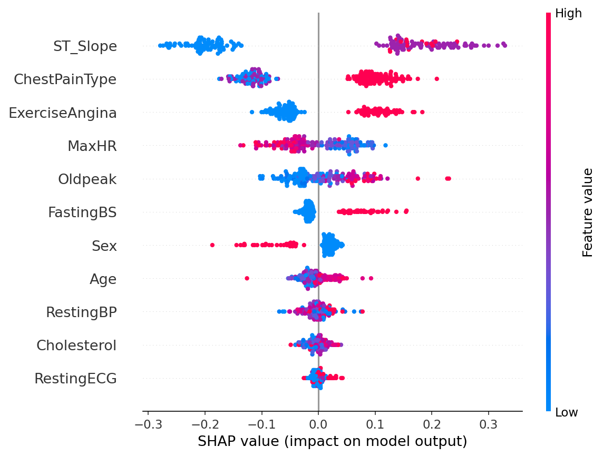
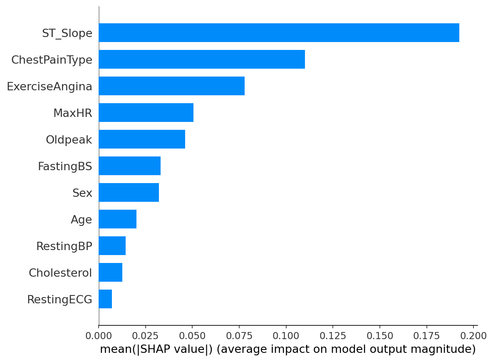

## Project history
The published paper (IJSREM, June 2025) used a Flask prototype and benchmarked five classifiers
(Logistic Regression, Decision Tree, Random Forest, SVM, XGBoost) on the Statlog Heart dataset.
After publication I extended the system on my own:
- SHAP explainability for the tree-based models
- an ECG-image classifier (YOLOv8) for scanned ECGs, served at /ecg/analyze
- a FastAPI backend with a React frontend, PDF risk reports and MongoDB storage

## SHAP findings

<Write 2-3 sentences yourself: the top features, whether they match clinical expectation,
and one thing that surprised you.>

## Evaluation
Stratified 80/20 split (random_state=42), SMOTE applied to the training data only.
Random Forest: 88.6% test accuracy; 5-fold cross-validation: 85.7% (±2.5).

## Limitations
- Research prototype, not a clinical tool, and not used by clinicians.
- Trained on the public Statlog Heart data.